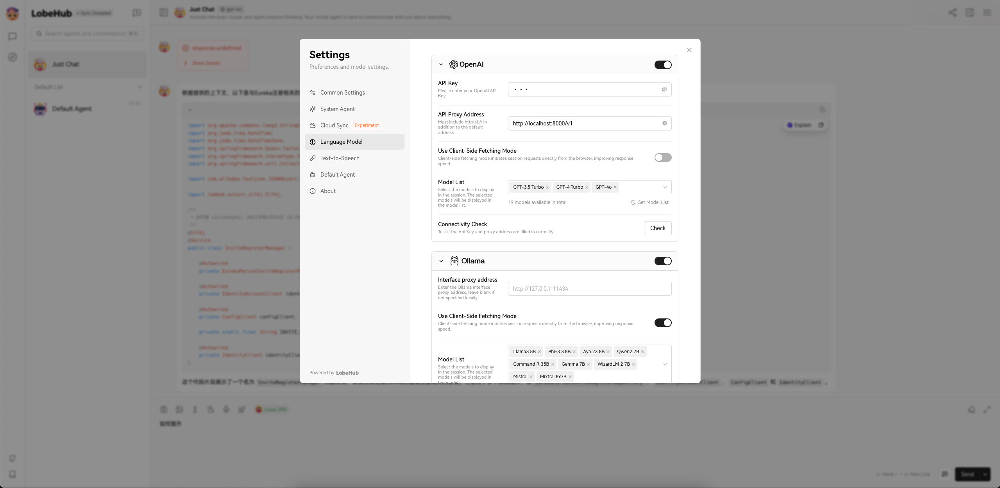

# Chat2Code

This repository reference [Chat-with-Github-Repo](https://github.com/peterw/Chat-with-Github-Repo?tab=readme-ov-file) contains Python scripts that demonstrate how to use Lobe Chat, OpenAI and Qdrant to chat with your code base.

We use Lobe Chat as chat client it will searches a dataset stored in Qdrant to find relevant information from any Git repository and generates responses based on the user's input.

## Files

- `src/utils/process.py`: This script clones a Git repository, processes the text documents, computes embeddings using OpenAIEmbeddings, and stores the embeddings in Qdrant instance.

- `src/utils/chat.py`: This script creates a Streamlit web application that interacts with the user and the Qdrant instance to generate chatbot responses using OpenAI, not very user friendly, if you want better user experence you can go the section Use Lobe Chat as chat client.

- `src/utils/chat.py` This script provides a class OpenAI-like streaming interface. Essentially, it is not truly streaming; it processes the response in a streaming manner to be compatible with various Chat Clients.

- `src/main.py`: This script contains the command line interface (CLI) that allows you to run the chatbot application.

## Setup

Before getting started, be sure to sign up for an [Qdrant](https://qdrant.tech/) and [OpenAI](https://openai.com/) account and create API keys.

To set up and run this project, follow these steps:

1. Clone the repository and navigate to the project directory:

```bash
git clone https://github.com/zhoue/chat2codes
cd chat2codes
```

2. Install the required packages with `pip`:

```bash
pip install -r requirements.txt
```

For development dependencies, you can install them using the following command:

```bash
pip install -r dev-requirements.txt
```

3. Set the environment variables:

Copy the `.env.example` file:

```bash
cp .env.example .env
```

Provide your API keys and username:

```
OPENAI_API_BASE=your_openai_api_base
OPENAI_API_KEY=your_openai_api_key
QDRANT_CLOUD_URL=your_qdrant_cloud_url
QDRANT_API_KEY=your_qdrant_cloud_api_key
QDRANT_COLLECTION_NAME=your_qdrant_collection_name
```

4. Use the CLI to run the chatbot application. You can either process a Git repository or start the chat application using an existing dataset.

> For complete CLI instructions run `python src/main.py --help`

To process a Git repository, use the `process` subcommand:

```bash
python src/main.py process --repo-url https://github.com/username/repo_name
```

You can also specify additional options, such as file extensions to include while processing the repository, the name for the Activeloop dataset, or the destination to clone the repository:

```bash
python src/main.py process --repo-url https://github.com/username/repo_name --include-file-extensions .md .txt --qdrant_collection_name my-dataset --repo-destination repos
```

To start the chat application using an existing dataset, use the `chat` subcommand:

```bash
python src/main.py chat --qdrant_collection_name my-dataset
```

The Streamlit chat app will run, and you can interact with the chatbot at `http://localhost:8501` (or the next available port) to ask questions about the repository.


## Use Lobe Chat as ChatClient

1. Follow the local installation guide of Lobe Chat to run it locally

```
$ git clone https://github.com/lobehub/lobe-chat.git
$ cd lobe-chat
$ pnpm install
$ pnpm dev
```

2. Start the chat service
```
python src/utils/api.py
```

3. Open [Lobe Chat](http://localhost:3010/) and update the Language Model to use the chat service

4. In Lobe Chat setting page update Language Model
API Key: any keywords
API Proxy Address: http://localhost:8000/v1



## License

[MIT License](LICENSE)